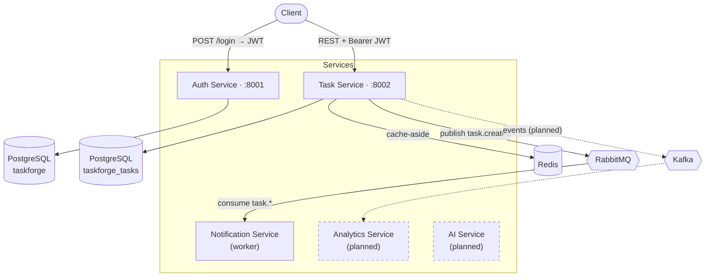

# TaskForge.AI

A distributed task-management platform built to demonstrate **microservices architecture**, **event-driven communication**, and **modern async Python backend engineering**.

> Built as a deep, hands-on study of the patterns that power real production systems — bounded-context service boundaries, database-per-service, stateless cross-service authentication, cache-aside, and asynchronous messaging.

**Status:** 🟢 Active development · **3 of 5 services live** (Auth, Task, Notification)

---

## Architecture



**The Task service validates Auth's JWTs locally** with a shared signing key — no per-request call back to Auth. Each service owns its **own database**; cross-service references (e.g. `owner_id`, `assignee_id`) are plain UUIDs, never foreign keys, because **a foreign key cannot cross a service boundary**.

---

## Engineering decisions worth defending

These are deliberate, and each maps to a real trade-off:

| Decision | Why |
|---|---|
| **Database-per-service** | Each service owns its data exclusively; no shared tables. A schema change in one service can never break another, preserving independent deployment. |
| **Stateless JWT auth across services** | Auth signs short-lived access tokens + rotating refresh tokens. Any service verifies a token locally with the shared key — no chatty auth call on every request. |
| **Cache-aside (Redis) on hot reads** | The task-list endpoint checks Redis first; on a miss it queries Postgres and populates the cache with a TTL. Writes invalidate via delete-on-write. Reads on a cache hit never touch the database. |
| **Async messaging (RabbitMQ)** | Task creation publishes a `task.created` event and returns immediately. The Notification service consumes it independently — a slow or down notifier never blocks or fails task creation. |
| **Repository pattern** | All SQL lives in repositories; endpoints stay thin and testable, and the storage layer can change without touching business logic. |
| **UUID primary keys** | Distributed-safe (no auto-increment races) and non-enumerable (no ID leakage). |
| **bcrypt for passwords, SHA-256 for refresh tokens** | bcrypt's slow salted hash defends low-entropy passwords; refresh tokens are high-entropy, so a deterministic SHA-256 hash makes them *lookup-able* for revocation. Different threat models, different tools. |

---

## Tech stack

**Backend:** Python 3.11 · FastAPI · SQLAlchemy 2.0 (async) · Pydantic v2 · Alembic
**Data:** PostgreSQL 16 · Redis 7
**Messaging:** RabbitMQ (aio-pika) · Kafka *(in progress)*
**Auth:** JWT (python-jose) · bcrypt
**Infra:** Docker Compose · *(Kubernetes & AWS planned)*

---

## Services

### Auth Service — `:8001` · DB `taskforge` · ✅ complete
Identity and access for the platform.

| Endpoint | Description |
|---|---|
| `POST /api/v1/auth/register` | Create a user (bcrypt-hashed password) |
| `POST /api/v1/auth/login` | Verify credentials → access + refresh tokens |
| `POST /api/v1/auth/refresh` | Rotate the refresh token, issue a fresh pair |
| `GET  /api/v1/auth/me` | Return the authenticated user (JWT-protected) |

### Task Service — `:8002` · DB `taskforge_tasks` · ✅ complete
The core domain: a `workspace → project → task` hierarchy.

| Endpoint | Description |
|---|---|
| `POST /api/v1/workspaces` | Create a workspace (caller becomes owner-member) |
| `GET  /api/v1/workspaces` | List the caller's workspaces |
| `POST /api/v1/workspaces/{id}/projects` | Create a project |
| `GET  /api/v1/workspaces/{id}/projects` | List projects |
| `POST /api/v1/projects/{id}/tasks` | Create a task (publishes `task.created`) |
| `GET  /api/v1/projects/{id}/tasks?status=` | List tasks (Redis-cached, filterable) |
| `PATCH /api/v1/tasks/{id}` | Update a task (invalidates cache) |

Highlights: stateless JWT validation, Redis cache-aside with delete-on-write invalidation, a composite index on `(project_id, status)`, and RabbitMQ event publishing.

### Notification Service — worker · ✅ complete
A RabbitMQ consumer bound to `task.*` on the `taskforge.events` topic exchange. Processes events asynchronously with acknowledgments, prefetch-based backpressure, and a durable queue that survives consumer downtime.

### Analytics Service — 🚧 planned
Read-heavy aggregations consuming Kafka events (via the outbox pattern).

### AI Service — 🚧 planned
Embeddings, RAG search, and LLM-powered features.

---

## Getting started

### Prerequisites
- Docker + Docker Compose
- Python 3.11

### 1. Start the infrastructure

```bash
cd infra
docker-compose up -d
```

This launches PostgreSQL, Redis, RabbitMQ (management UI on `:15672`), Kafka, and Kafka UI (`:8080`).

### 2. Create the Task service database

```bash
docker exec -it tf-postgres psql -U taskforge -d taskforge \
  -c "CREATE DATABASE taskforge_tasks;"
```

(The Auth service uses the default `taskforge` database created by Compose.)

### 3. Run a service

Each service is self-contained with its own virtualenv:

```bash
cd services/auth-service
python3.11 -m venv .venv && source .venv/bin/activate
pip install -e .
alembic upgrade head
uvicorn app.main:app --reload --port 8001
```

Repeat for `task-service` on port `8002` (`alembic upgrade head`, then `uvicorn ... --port 8002`).

Start the notification worker:

```bash
cd services/notification-service
python3.11 -m venv .venv && source .venv/bin/activate
pip install -e .
python -m app.worker
```

### 4. Explore

- Auth API docs → http://localhost:8001/docs
- Task API docs → http://localhost:8002/docs
- RabbitMQ UI → http://localhost:15672 (`taskforge` / `taskforge_dev_password`)

**End-to-end flow:** log in via Auth → copy the access token → authorize in the Task docs → create a workspace, project, and task → watch the Notification worker print the event in real time.

---

## Project structure

```
TaskForge-AI/
├── infra/
│   └── docker-compose.yml        # Postgres, Redis, RabbitMQ, Kafka, Kafka UI
├── services/
│   ├── auth-service/             # identity, JWT, refresh rotation
│   ├── task-service/             # workspaces/projects/tasks, cache, events
│   ├── notification-service/     # async RabbitMQ consumer
│   ├── analytics-service/        # (planned)
│   └── ai-service/               # (planned)
├── frontend/                     # React + TypeScript (planned)
└── README.md
```

Each service follows a consistent layout: `app/api` (routes), `app/core` (config, security, cache, events), `app/db` (engine, base), `app/models`, `app/repositories`, and `app/schemas`.

---

## Roadmap

- [x] Auth service — register, login, JWT, refresh rotation, protected routes
- [x] Task service — full CRUD, cross-service JWT, Redis cache-aside
- [x] Notification service — async RabbitMQ consumer
- [ ] Kafka event backbone + the **outbox pattern** for reliable publishing
- [ ] Analytics service — event-driven aggregations
- [ ] AI service — embeddings, RAG search
- [ ] React + TypeScript frontend
- [ ] Kubernetes deployment
- [ ] AWS deployment + CI/CD

---

## What this project demonstrates

Practical, defensible experience with the patterns behind production distributed systems: **service decomposition by bounded context**, **database-per-service**, **stateless authentication at scale**, **caching strategies and invalidation**, and **event-driven, asynchronous communication** — all built with a modern async Python stack.